# Различные варианты оформления графиков в Plotly
Изменения каждого варианта:
- Первый
  - Зеленый (салатовый) цвет (**больше пойдет что-то темное**)
  - Черный текст
  - Другой шрифт
  - Заливка под графиком плотности распределения вероятности
  - Обводка столбцов гистограммы
  - Сетка на гистограмме
  - Рамка графика
- Второй
  - Серый цвет
  - Заливка под графиком плотности распределения вероятности
  - Маркеры на графике плотности распределения вероятности
  - Черный текст
  - Другой шрифт

 

Изображения (гистограмма, линейный график вместе и на странице аналитики): 
- Текущий вариант: 
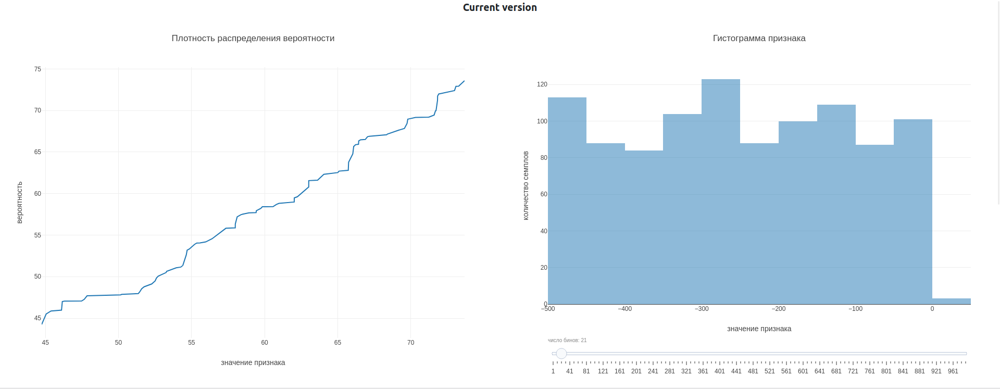
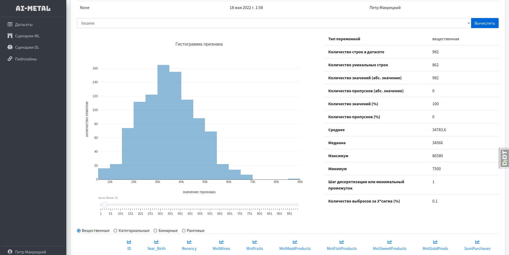
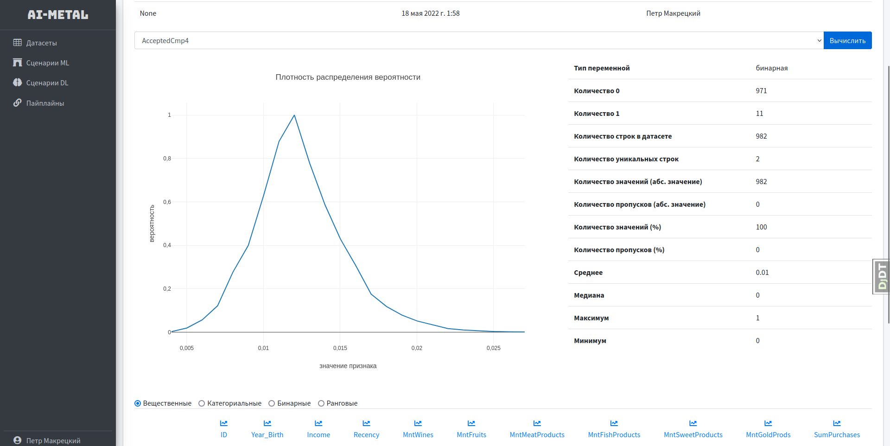
- Первый вариант: 
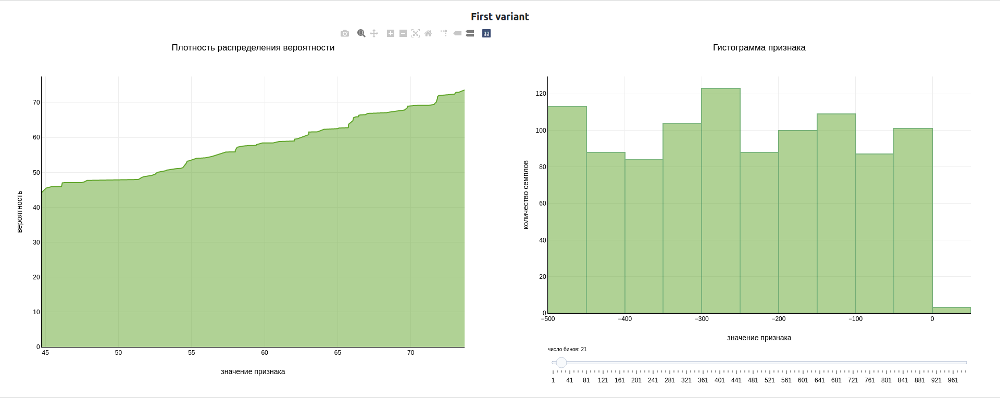
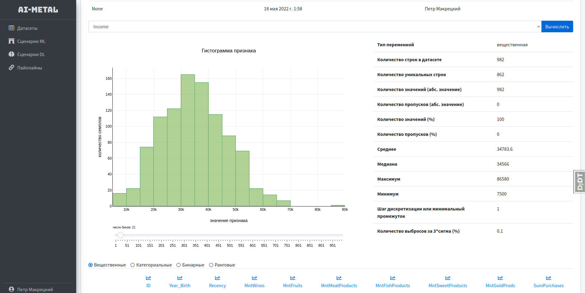
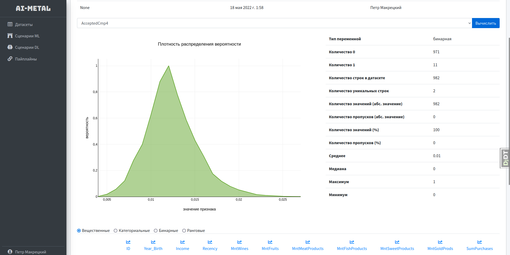
- Второй вариант: 
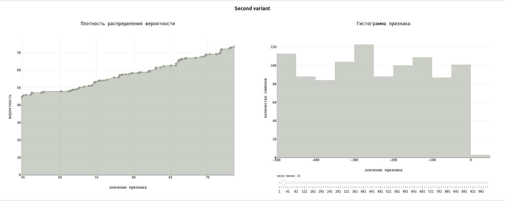
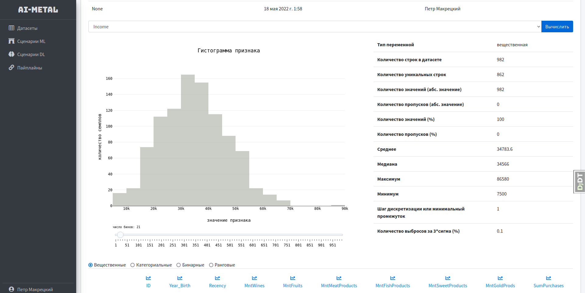
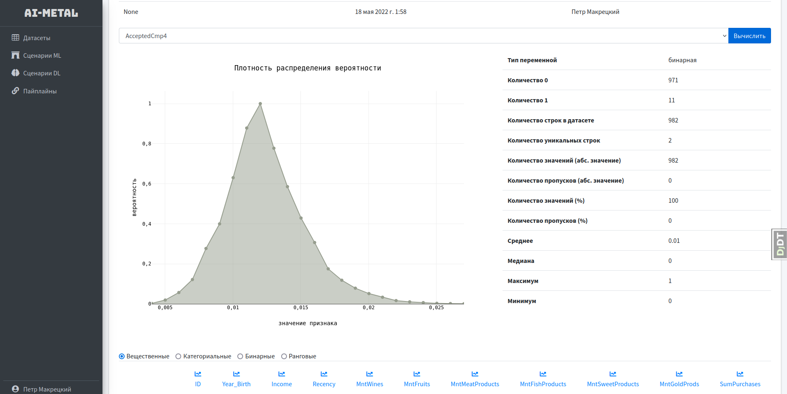
- Вариант, относительно которого будет вестись обсуждение: 
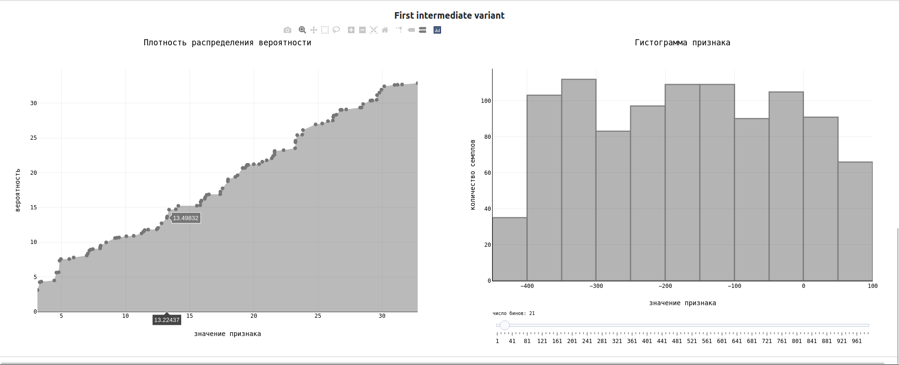
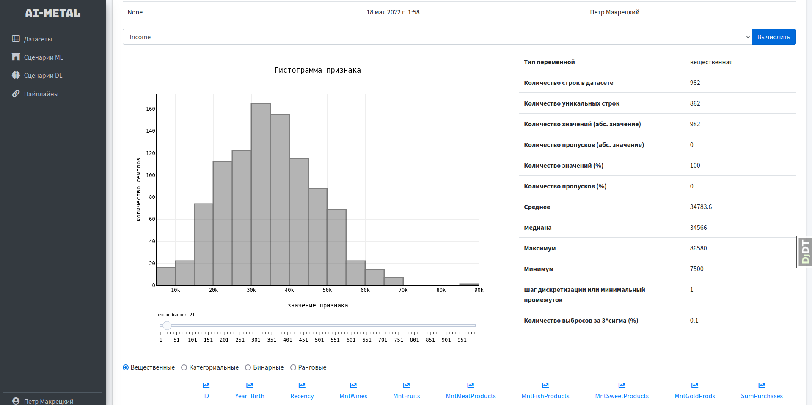
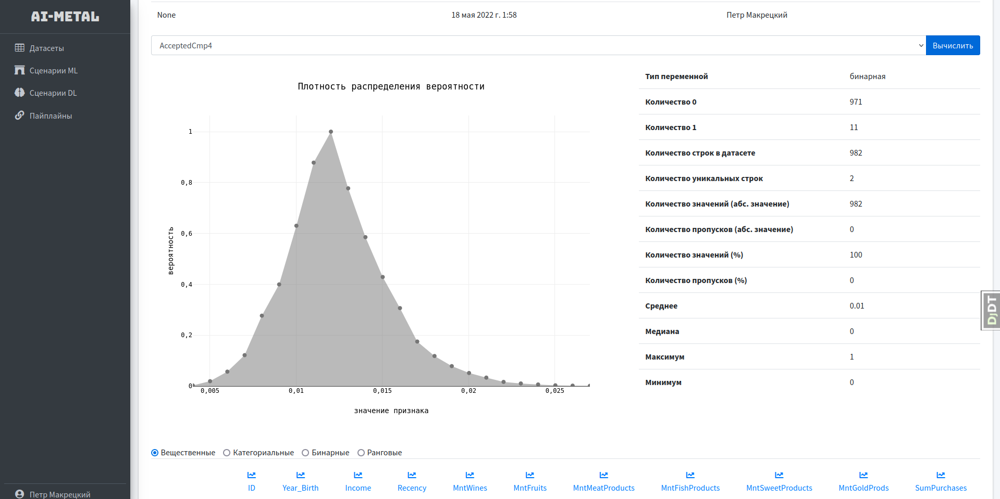

Что, я считаю, стоит оставить:
- Обводка столбцов, потому что это позволяет избежать сливание столбцов, когда их высота равна
- Заливка на плотности распределения вероятности, потому что это делает график стилистически более похожим на 
гистограмму

Полезные ссылки:
- [Шрифты](https://www.w3.org/Style/Examples/007/fonts.ru.html)