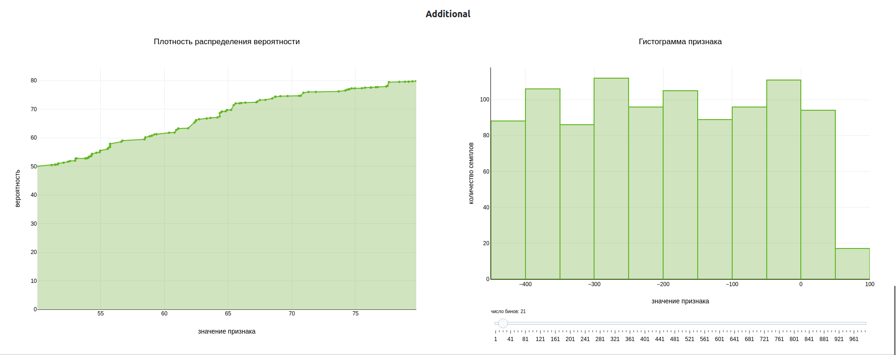
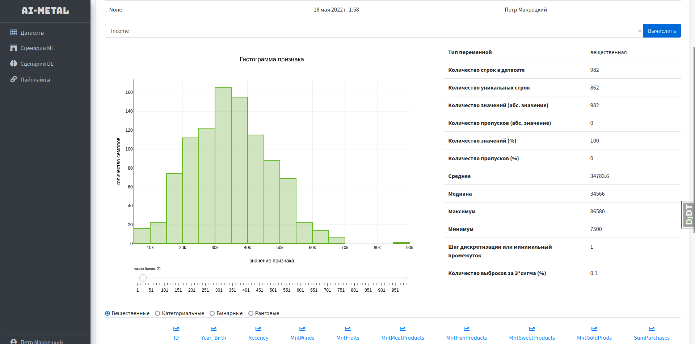
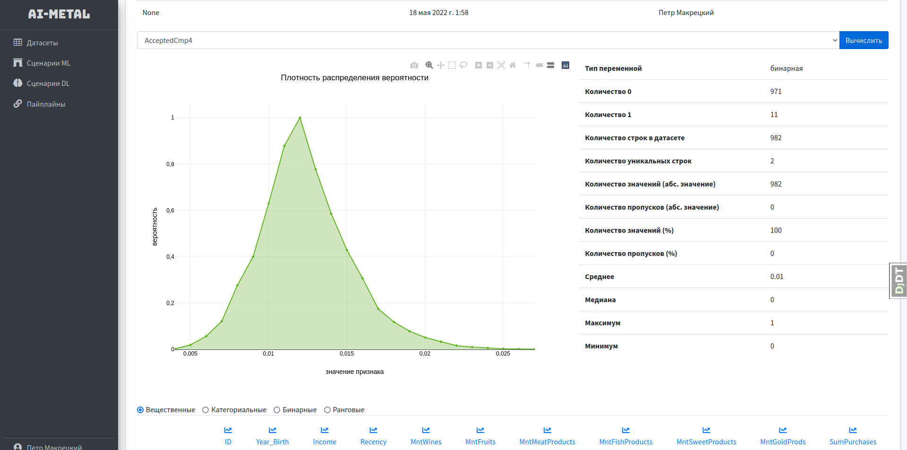
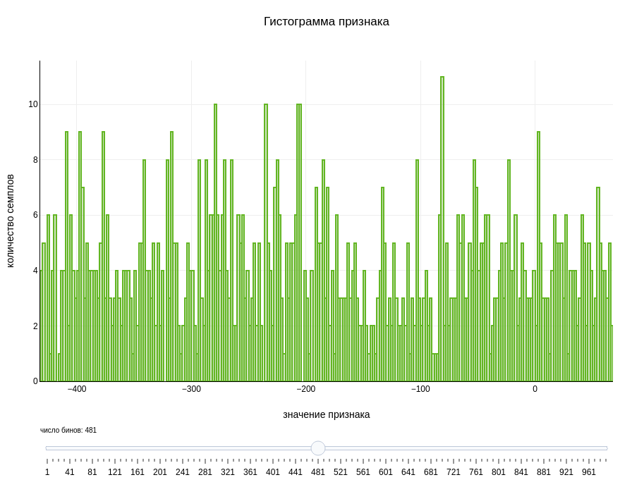
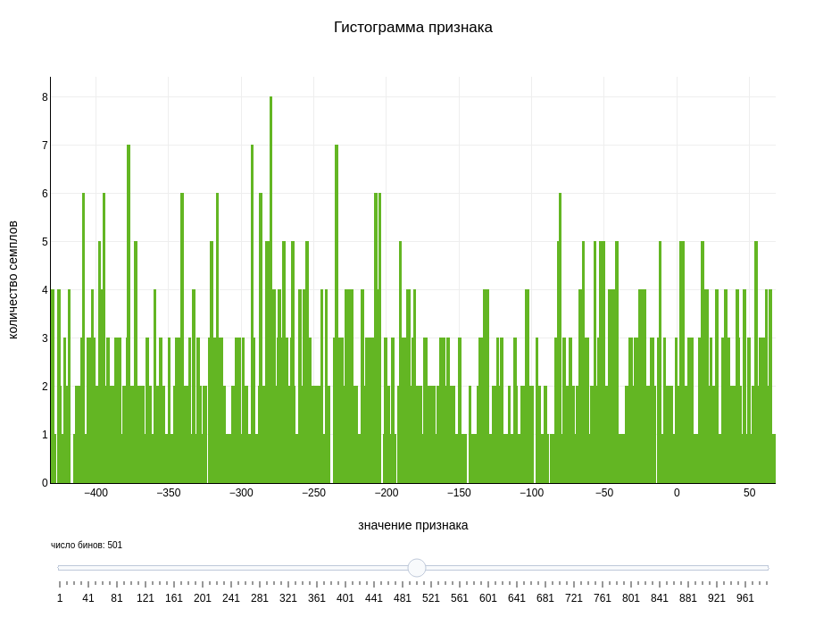

# Различные варианты оформления графиков в Plotly

[Графики в новом стиле](https://github.com/petiayko/plotly_designs/tree/master/new_plots)

Все изображения (гистограмма, линейный график вместе и на странице аналитики): 

- Текущий вариант: 
  
  
  
   
- Первый вариант: 
  - Зеленый (салатовый) цвет (**больше пойдет что-то темное**)
  - Черный текст
  - Другой шрифт
  - Заливка под графиком плотности распределения вероятности
  - Обводка столбцов гистограммы
  - Сетка на гистограмме
  - Рамка графика
  
  
  
   
- Второй вариант: 
  - Серый цвет
  - Заливка под графиком плотности распределения вероятности
  - Маркеры на графике плотности распределения вероятности
  - Черный текст
  - Другой шрифт
  
  
  
   
- **ОБСУДИТЬ:** 
  - Только точки на графике плотности распределения вероятности
  - Заливка под графиков плотности распределения вероятности
  - Другой шрифт
  - Обводка столбцов гистограммы
  - Сетка на гистограмме
  - Рамка графика
  
  
  
  На большом числе бинов (до 500 и больше 500): 
  
  
   
- Первый вариант правок:
  - Размер маркеров с 8 до 5
  - Черные маркеры
  - Черная линия
  - Шрифт старый (согласованный с окружающими элементами)
  - Заливка светлее
  - Граница графика слева
  
  
  
  На большом числе бинов (до 500 и больше 500): 
  
  
   
- Второй вариант правок:
  - Размер маркеров с 8 до 5
  - Серые маркеры
  - Серая линия
  - Шрифт старый (согласованный с окружающими элементами)
  - Заливка светлее
  - Граница графика слева
  
  
  
  На большом числе бинов (до 500 и больше 500): 
  
  
   
- Также для рассмотрения:
  - Маркеры 5
  - Зеленые цвета
  - Черный текст
  - Заливка под графиком плотности распределения вероятности
  - Обводка столбцов гистограммы
  - Рамка графика
  
  
  
  На большом числе бинов (до 500 и больше 500): 
  
  

 Что, я считаю, стоит оставить:
- Обводка столбцов, потому что это позволяет избежать сливание столбцов, когда их высота равна
- Заливка на плотности распределения вероятности, потому что это делает график стилистически более похожим на
  гистограмму

 Полезные ссылки:
- [Шрифты](https://www.w3.org/Style/Examples/007/fonts.ru.html)