# Графики аналитики в сером цвете (стиль аналогичен одобренному для основной аналитики)

- Столбчатая диаграмма с ошибкой
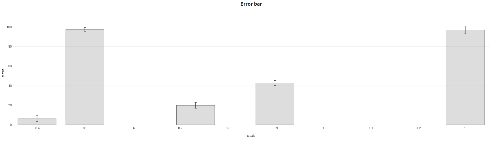
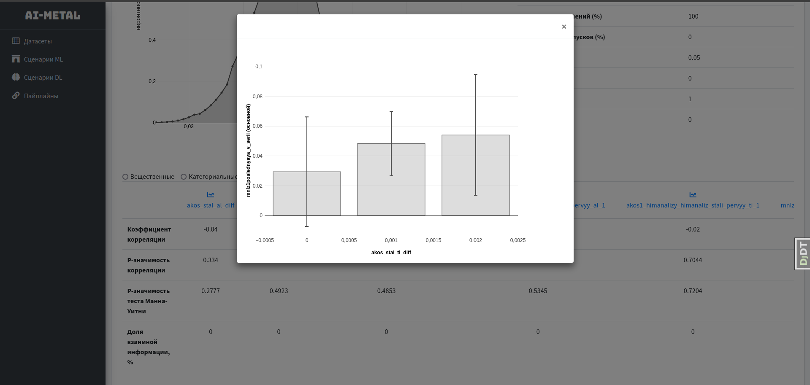
- Ящик с усами
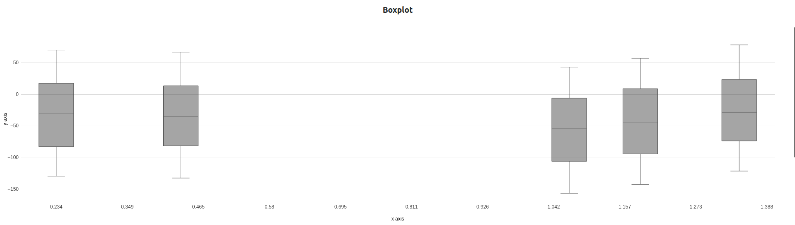
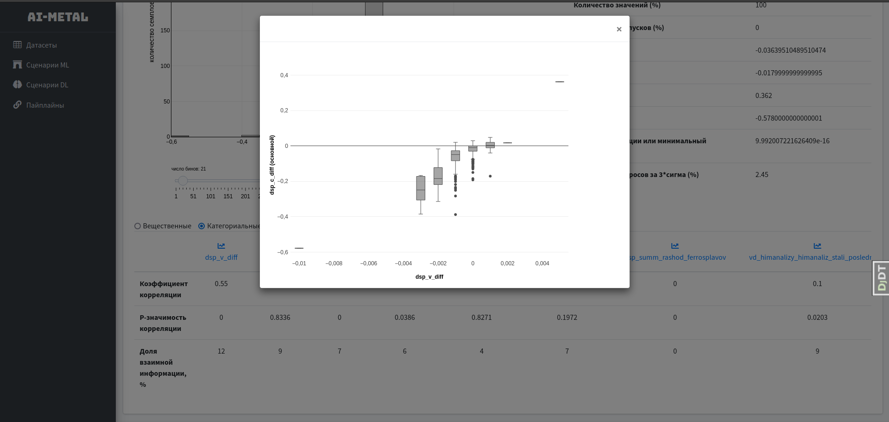
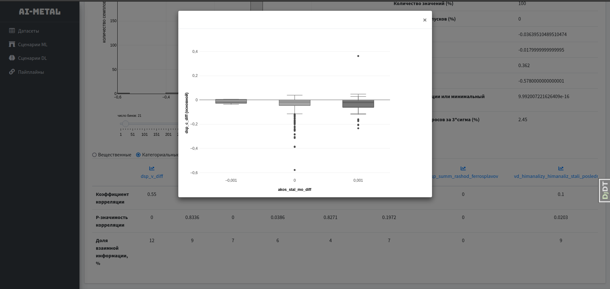
- Парная гистограмма
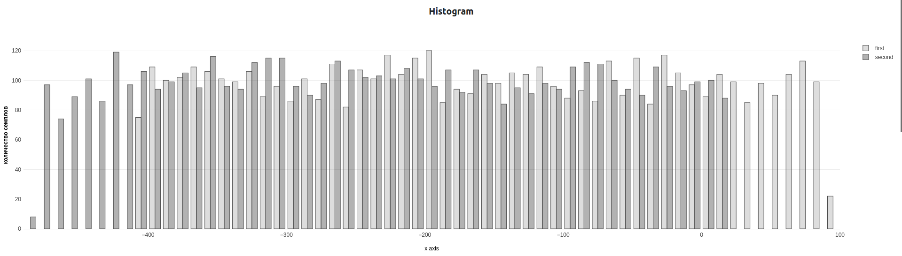
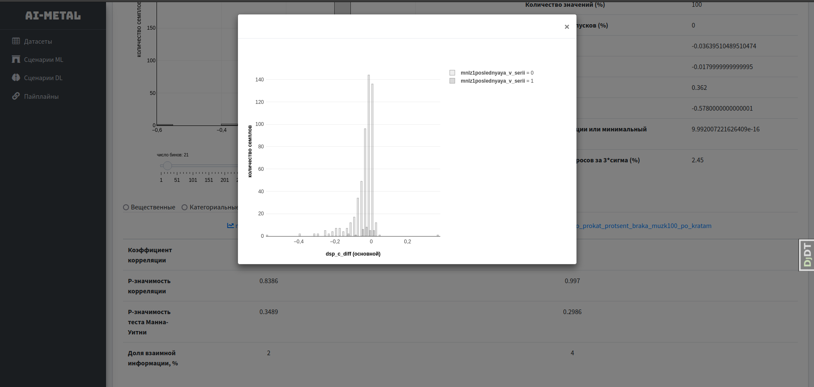
- Параллельные координаты
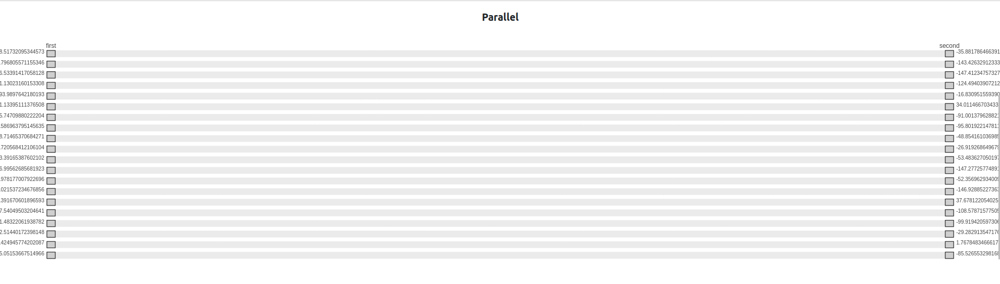
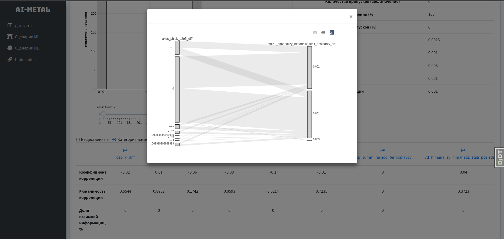
- Точечная диаграмма
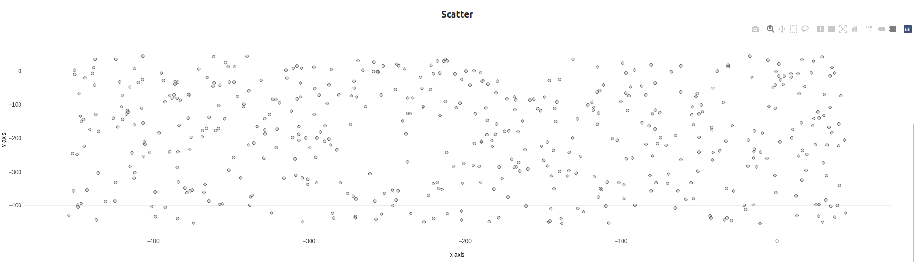
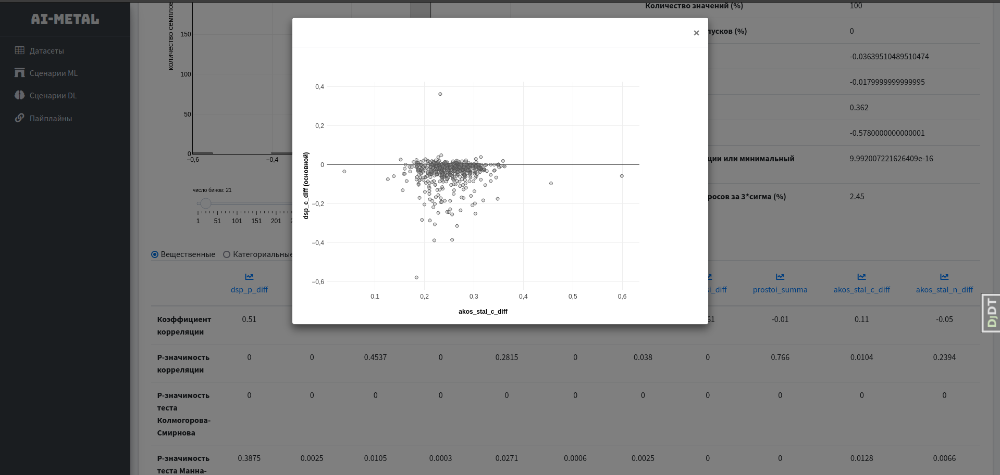
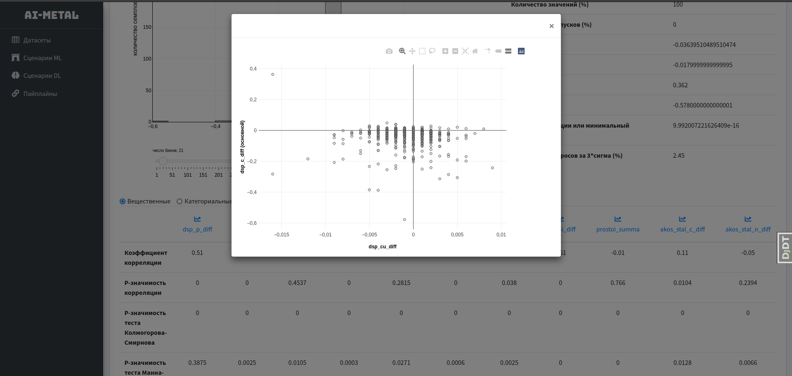
